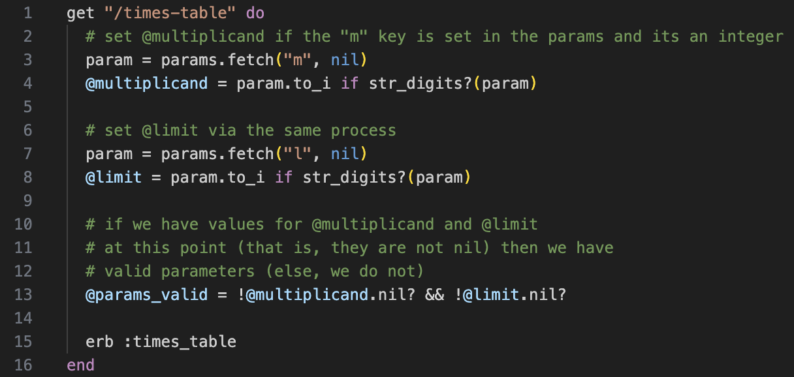

# **Spring Semester Team Software Project**

In the spring semester, each team will implement a web system according to the user stories you collected in the autumn semester. The implementation will follow a mini-scrum framework, a simplified version of an agile software development process. Read this project brief carefully and make sure you understand the details. 

Jump to:
- [Mini-Scrum Framework](#mini-scrum-framework)
  - [Weekly Schedule](#weekly-schedule)
  - [Team Supervisors](#team-supervisors)
  - [Client Questions](#client-questions)
- [Assessment](#assessment)
  - [Report](#report)
  - [Demonstration](#demonstration-recording)
  - [Team Operating Agreement](#team-operating-agreement)
  - [Assessment Criteria](#assessment-criteria)
  - [Peer Assessment](#peer-assessment-buddycheck)
- [Unfair Means and Generative AI](#unfair-means-and-generative-ai)
- [Futher Questions](#further-questions)

## Mini-Scrum Framework

The key principles of the mini-scrum are as follows:
- Incremental development: Build your system in small, manageable increments over multiple iterations (i.e., sprints);
- Collaboration: Work together as a team to deliver a working system that meets the client's requirements.

For each sprint (lasting 2 weeks), your team must:
- Review the previous sprint;
- Plan the current sprint (e.g., breakdown user stories into tasks, estimate the time needed for each task);
- Do the tasks according to the plan.

To facilitate this process, we will have _weekly scrum meetings_ every Tuesday at 2 pm from Week 1 to Week 11. 
Check out the [seating plan](misc/cr3-cr5-scrum-meetings.pdf) to find out where you need to be.

The key activities for the scrum meetings are:
- Electing a scrum master (max 3 mins): Each week, a different team member will be the scrum master (the team leader for the week), responsible for leading the discussion;
- Individual stand-ups (max 3 mins each): Each team member will share what they have done, what they will do, and any blockers they have;
- Team progress review (max 15 mins): Discuss the current progress, any blockers, and adjust the next steps together.
- Planning and reflection: At the start of each sprint, reflect on the previous sprint and plan the next sprint (e.g., major tasks to complete, prioritise tasks, etc.).
- Task management (continuously): Use [*GitLb Issue Boards*](https://docs.gitlab.com/ee/user/project/issue_board.html) to manage all tasks, including non-technical tasks (e.g., report section X). This will help you to keep track of what needs to be done and who is doing what. **Using the Issues Boards is compulsory.** Feel free to additionally use Labels (e.g., Database, Testing) and Milestones (e.g., Interim Submission, Final Submission) to categorise and prioritise tasks. 

### Weekly Schedule

You should schedule stories to implement according to your prioritisation of the client's requirements. However, your implementation plan may also be necessarily constrained by the order in which technical material is covered in lectures and labs. Therefore, check out the lecture schedule and plan the stories you will implement for each sprint accordingly.

Below is a suggested week-by-week list of pointers for your team that you can use to check your plan of action:

| Week | Suggested Activities |
| --- | --- |
| 1 | Meet your team members and supervisor. Complete a Team Operating Agreement. |
| 2-3 | Sprint 1 (views and databases) |
| 4-5 | Sprint 2 (unit tests) |
| 6-7 | Sprint 3 (more implementations and tests, prepare for the formative assessment) |
| 8-9 | Sprint 4 (refactoring, new requirement changes) |
| 10-11 | Sprint 5 (remaining tasks, prepare for the summative assessment) |
| 12 | Don't forget to complete the peer assessment (BuddyCheck) by Friday. |

### Team Supervisors

During the weekly scrum meetings, your _team supervisor_ will be present to do a **5-minute check-in** with each team. 
To make this efficient, the scrum master (the team leader for the week) must submit a [Google Form](https://docs.google.com/forms/d/e/1FAIpQLSd_qwPSAQJeSiBA8xI6gf4RWGlZkdjAkUFGKoQDQM1wtiHGxQ/viewform?usp=dialog) summarising any outstanding issues (e.g., conflicts, lack of contribution) that need to be discussed with the supervisor **at least one hour before the meeting**.

- Tip: If you have difficulties signing in to the Google Form, please try to sign in with your TUOS email account on a *Private (Incognito)* window.

### Client Questions

You can also use the same discussion board (Forum: Team Project - Client Questions) to communicate with the client, as you did in the autumn semester.

## Assessment

| Type | Deadline | Deliverables | Semester Weighting |
| --- | --- | --- | --- |
| Formative | Friday 27 March, 15:00 (Week 7) | Report, Team Operating Agreement | 0% |
| Summative | Friday 16 May, 15:00 (Week 11) | Report, 10-min demo recording, Team Operating Agreement | 100% |

The summative assessment will be based on the interim report. It is to give you feedback on your progress and to help you improve your system for the final submission. The final submission will be assessed based on the final report and the 10-min demo recording.

After the summative assessment, additional changes to the user stories will be requested to mimic real-world additions/changes from clients. How you handle these changes in the remaining sprints will be part of the final assessment.

Note that the formative assessment is not graded, but it is compulsory. If you do not submit the formative report, you will not be able to submit the summative report.

### Report

The interim/final report should include the following information:
- Team ID, members, and the summary of each member's major contributions.
  - A map between each member's name and their GitLab user name, especially if you accidentally made commits under your private emails.
- The exact command(s) needed to install/start your system and to run your tests.
- The predefined usernames (e.g., admin1, reader1) for inspecting your system. For each account, the password must be the same as the username.
- A list of all your user stories with their status (e.g., to-do, in-progress, or done).
  - Use colours and highlights to distinguish different statuses.
- What you have done in terms of testing and refactoring (one section for testing, and another section for refactoring).
  - You should present *concrete examples* along with your testing/refactoring *summary* to demonstrate the quality of your testing/refactoring.
  - When you include code fragments, you must use source code colouring, line numbers and a proper caption, as shown in Listing 1 below.
- Your burndown chart, showing total number of issues and the number of issues closed each week. 
- Overall, use figures and tables with clear captions, wherever appropriate.
- Append your TOA signed by all team members to the report as an appendix. The quality of the TOA is not subject to assessment, but the submission is compulsory.

### Demonstration (Recording)

Your team will be required to submit a 10-minute demonstration recording of your system. Upload the recording to YouTube as an **unlisted video** and submit the link to the video in your report.

Here are some remarks for you:
- Be on time (no more than 10 minutes!).
- It's for the client – make it easy to follow and focus on your team's key achievements.
- After all, a good demonstration is a good sales pitch.

### Team Operating Agreement

Each team must have a **signed team operating agreement**, as explained in Semester 1. 

- Use this [template](https://docs.google.com/document/d/1P8iJzSOMmNrrAg1PFk8EaNHczwZWpWJm/edit?usp=sharing&ouid=110276789189860516501&rtpof=true&sd=true) (TUOS login required) if your team has not created one. 
- It is a living document and should be updated as the need arises throughout the project.
- It will set out ground rules for working as a team and serve as an essential baseline in resolving disagreements and conflicts, if any.
- It must be signed by all team members and submitted as an appendix to the report.

### Assessment Criteria

We will use (1) your team repository, (2) your team report, and (3) your team demo recording to assess your work. The following table details the criteria against which your team's work will be marked. The overall mark is the average of each of the marks for each aspect.

| **Aspect** | **Indicative Criteria** |
| --- | --- |
| Implementation | The completeness and quality of your system. The extent to which it implements the client's requirements, how usable it is, how polished it is, and the extent to which it crashes and/or throws errors. |
| Code Quality | The quality of your code, including good coding principles, such as useful variable names, code comments, etc. The basic organisation of your code into units, and its overall structure. |
| Testing | The quality of your tests, including unit tests, integration tests, and system tests. The extent to which you have justified the level of coverage that you have obtained. |
| Refactoring | The quality of your refactoring. The extent to which your team has clear evidence of refactoring efforts written in the report. |
| Deployment | The extent to which it was easy and straightforward to deploy and get your system running—on the basis of your instructions and the implementation of your deployment process—from Git checkout to the commands needed to start the application. |
| Report | The quality of your team report, the extent to which it details all the requested information, including changes to stories, basic information about using your system etc. |
| Demonstration | The quality of your team demonstration. The extent to which it demonstrates key user stories effectively within the limited time. |

Regarding your team repository:
- We will look at **the last commit** to the team's repository **before the deadline** for the assessment.
- Ensure all the **necessary files** are committed to your team repository **by the deadline**. Otherwise, you will not receive the mark you deserve.
- We will _not_ check out other repositories (e.g., your personal repository from the last semester, or another Git repository).
- **All members** should use **GitLab Issues** and make **regular commits**. We will check that you have been actively engaging with the project by investigating your activity on GitLab. For example, just one or two commits or a sudden rush of commits just before the deadline is not good. 

Regarding deployment:
- We will use **Codio** to run and test your code. Therefore, it is strongly recommended that you develop on Codio; otherwise, you must at least deploy often to Codio as it is the required deployment platform.
- We will use **README** to run and test your code. Ensure that your README is up to date and contains the necessary information to run and test your system.
- Ensure that your `Gemfile` is up to date. If we cannot run your application on Codio due to missing gem information, this will severely negatively affect your mark.
- (Pro-tip) Attempt a **clean install** before your final commit to check whether your system is successfully deployed and running on Codio.

### Peer Assessment (BuddyCheck)

You will be using BuddyCheck to rate yourself and your team members on the following criteria:

1. Attendance and punctuality (to team meetings, etc.).
2. Ability to work effectively with other team members.
3. Quality of contributions.
4. Timeliness of contributions.

Your final individual mark will be formed from a scaling factor that is applied to your overall team mark. The scaling factor (capped at +/-30% to emphasise team work) is determined by your own self and peer assessment, and those returned by your team members. 

After the BuddyCheck, there will be an official claim period for any discrepancies in the peer assessment. No further changes will be accepted after the claim period.

## Unfair Means and Generative AI

It is essential to bear in mind the departmental rules on unfair means. Activities such as **plagiarism** or **collusion** will be treated as serious academic offences. This could lead to the award of a grade of zero for your submission.

We will be closely scrutinising submissions to detect such practices because it is important that this team project is a genuine reflection of your own understanding of the module.

To avoid any potential accidental wrongdoings, it is especially important that you do not discuss your solutions with other groups. If you have non-technical questions, please use the discussion board (Forum: Team Project - Non-coding Issues). If you have technical questions, please consult with your demonstrators.

We acknowledge that **Generative AI**, such as Google Bard and OpenAI ChatGPT, can be useful in learning. For example, it is okay to use Gen-AI to try various programming exercises. However, **the use of Gen-AI is prohibited in any of your submissions** subject to the assessment (i.e., the reports and the code commits to the team repository). For example, you must _not_ use the code generated by Gen-AI in the code pushed to your team repository. It is crucial that you learn by doing the project by yourself, and gaining an unfair advantage through the use of Gen-AI in the assessment will be treated as unfair means.

## Further Questions

If you have any questions, follow the steps below:
1. Check this brief again carefully to see if the answer is here.
2. Check the module [FAQ](project-FAQ.md).
3. Check the discussion board (Forum: Team Project - General) to see if your question has already been answered. 
4. Post your question on the discussion board (Forum: Team Project - General) if you cannot find the answer.
